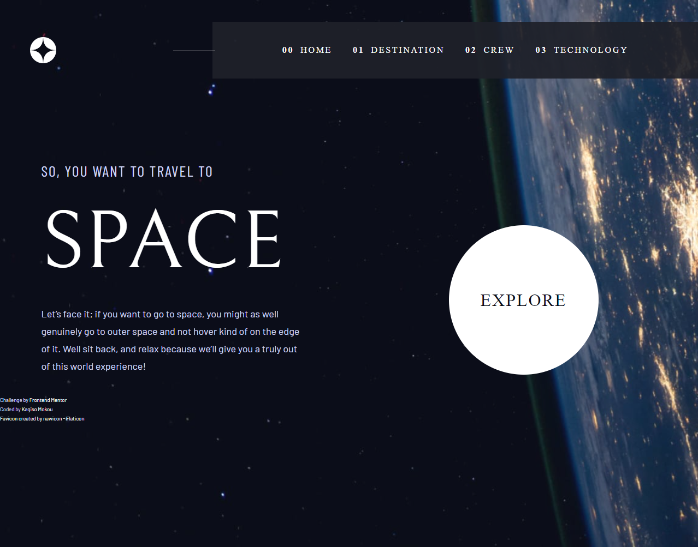

# Space Tourism

A website designed to immerse users in the realm of space exploration and travel. This website serves as a gateway to the future of commercial space travel.

## Table of contents

- [Overview](#overview)
  - [Links](#links)
  - [Features](#features)
  - [Built with](#built-with)
  - [Screenshot](#screenshot)
- [Author](#author)
- [Acknowledgments](#acknowledgments)

## Overview

### Links

- Live Site URL: [Live Demo](https://kagiso31.github.io/space-tourism)

### Features

- Responsive Design
- Accessible Carousel
- Accessible Tabs

### Built with

- Semantic HTML5 markup
- Mobile-first workflow
- [React](https://reactjs.org/) - JS library
- [Sass](https://sass-lang.com/) - CSS Preprocessor

### Screenshot

## Author

- Website - [Kagiso Mokou](https://kagiso31.github.io/portfolio)
- LinkedIn - [Kagiso Mokou](https://www.linkedin.com/in/kagiso-mokou-50824a264)

## Acknowledgments

This is a solution to the [Space tourism website challenge on Frontend Mentor](https://www.frontendmentor.io/challenges/space-tourism-multipage-website-gRWj1URZ3). Frontend Mentor challenges help you improve your coding skills by building realistic projects.
